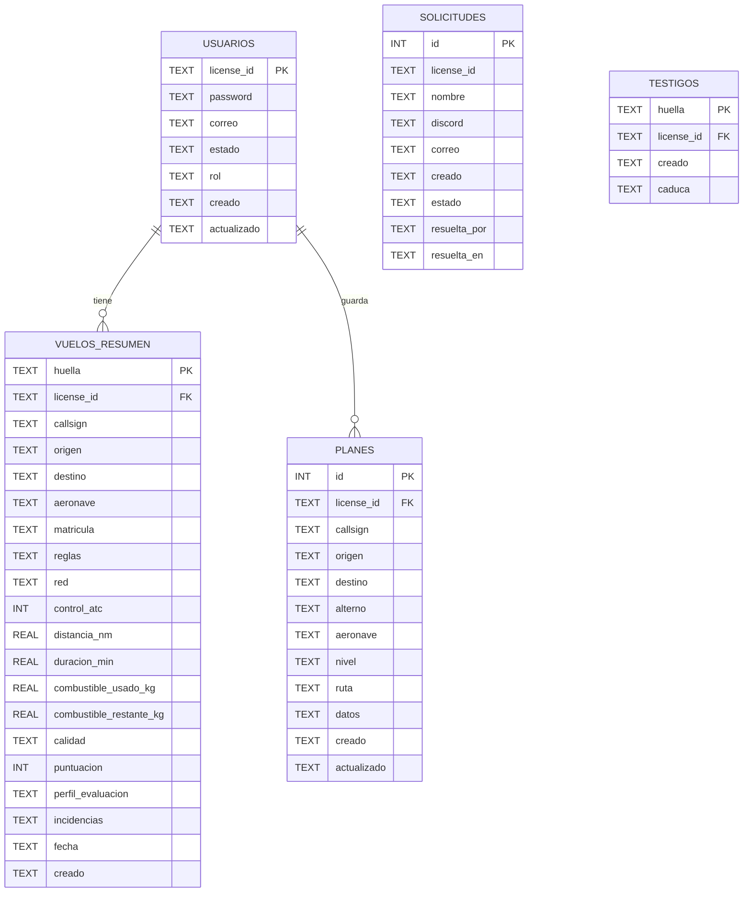
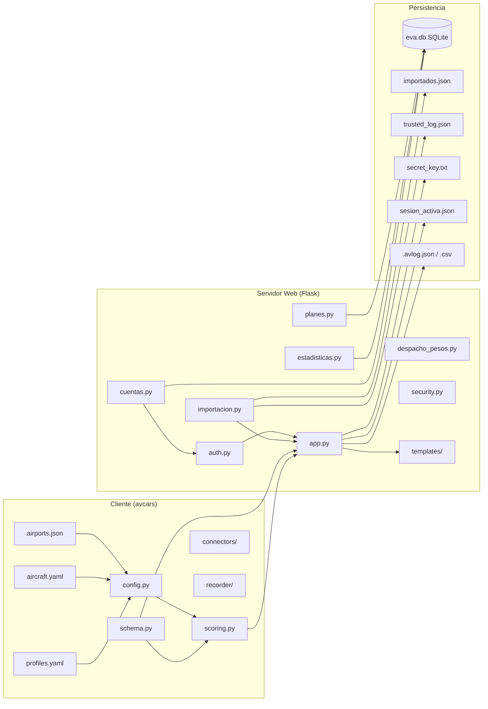

# Documentación Completa del Proyecto EvA

---

## 1. Visión General

**EvA (Evaluación de Vuelos Airliner)** es un sistema de cartilla virtual para pilotos de simulación (VATSIM/IVAO/OFFLINE) que permite:

- **Grabar vuelos** desde el simulador (X-Plane, MSFS via SimConnect, vPilot) mediante un cliente de escritorio (`avcars`)
- **Evaluar automáticamente** cada vuelo contra criterios VFR estandarizados
- **Publicar resultados** en una web (cartilla) donde cada piloto ve sus vuelos y la aerolínea ve estadísticas agregadas
- **Gestionar usuarios** (altas por solicitud, roles, bloqueos, recuperación de contraseña)

**Principio arquitectónico clave:** El motor de evaluación **no se duplica**. El cliente y el servidor web importan el mismo código (`avcars.evaluation.scoring`), garantizando que evaluar en local y en la web den **exactamente el mismo resultado**.

---

## 2. Arquitectura y Componentes

```
┌─────────────────────────────────────────────────────────────────────────────┐
│                           PROYECTO EvA                                       │
├─────────────────────┬─────────────────────────────┬─────────────────────────┤
│   CLIENTE (desktop) │         SERVIDOR WEB        │      DESPLIEGUE         │
│   D:\proyectos\eva\ │      D:\proyectos\eva\web\  │   VPS Clouding.io       │
│   client/           │      app.py (Flask)         │   Ubuntu 24.04          │
├─────────────────────┼─────────────────────────────┼─────────────────────────┤
│ • avcars/           │ • Rutas:                    │ • eva.service (systemd) │
│   - schema.py       │   /login, /vuelos, /vuelo/  │ • gunicorn (2 workers)  │
│   - scoring.py      │   /aerolinea, /plan,        │ • nginx (reverse proxy) │
│   - config.py       │   /gestion/*, /api/*        │ • Let's Encrypt (HTTPS) │
│   - connectors/     │ • Templates (Jinja2)        │ • Copias diarias 4:00   │
│   - recorder/       │ • Static (CSS, SVG)         │ • SSH only (no password)│
│   - evaluation/     │ • SQLite (eva.db)           │                         │
│ • config/           │                             │                         │
│   - profiles.yaml   │                             │                         │
│   - aircraft.yaml   │                             │                         │
│   - airports.json   │                             │                         │
└─────────────────────┴─────────────────────────────┴─────────────────────────┘
```

### Flujo de datos principal

```
┌──────────┐    .avlog.json    ┌──────────────┐    evaluate_flight()   ┌─────────────┐
│ SIMULADOR│ ────────────────▶ │ CLIENTE      │ ─────────────────────▶ │ VERDICTO    │
│ (X-Plane,│    (graba track,  │ avcars       │   (mismo motor en      │ (score,     │
│  MSFS,   │     events,       │ recorder     │    cliente y web)      │  passed,    │
│  vPilot) │     plan, pilot)  │              │                        │  items[])   │
└──────────┘                   └──────────────┘                        └──────┬──────┘
                                                                             │
                          ┌─────────────────────────────────────────────────┘
                          ▼
                   ┌──────────────┐    POST /api/registro/upload    ┌─────────────┐
                   │ PILOTO       │ ─────────────────────────────▶ │ SERVIDOR    │
                   │ (sube fichero│    (importacion.py valida:     │ WEB (Flask) │
                   │  desde UI)   │     huella única, dueño,       │             │
                   └──────────────┘     no duplicados)             │ • Guarda    │
                                                     │             │   .avlog.json│
                                                     │             │ • Inserta en │
                                                     │             │   vuelos_resumen│
                                                     │             │   (SQLite)   │
                                                     │             │ • Evalúa     │
                                                     │             │   con scoring│
                                                     ▼             └─────────────┘
                                            ┌──────────────┐
                                            │ CARTELLA     │
                                            │ WEB (/vuelos,│
                                            │  /vuelo/<id>)│
                                            └──────────────┘
```

---

## 3. Esquema de Base de Datos (SQLite: `web/data/eva.db`)

### Tablas Principales

```sql
-- USUARIOS: Cuentas de pilotos y admins
CREATE TABLE usuarios (
    license_id  TEXT PRIMARY KEY,     -- ej. "EVA18L", "AVH-1001"
    password    TEXT NOT NULL,        -- PBKDF2-SHA256 (260k iteraciones)
    correo      TEXT NOT NULL DEFAULT '',
    estado      TEXT NOT NULL DEFAULT 'activa',  -- 'activa' | 'bloqueada'
    rol         TEXT NOT NULL DEFAULT 'piloto',  -- 'piloto' | 'admin'
    creado      TEXT NOT NULL,        -- ISO8601 UTC
    actualizado TEXT NOT NULL
);
CREATE UNIQUE INDEX usuarios_correo_unico ON usuarios (correo) WHERE correo <> '';

-- SOLICITUDES: Peticiones de alta (pendientes de aprobación admin)
CREATE TABLE solicitudes (
    id           INTEGER PRIMARY KEY AUTOINCREMENT,
    license_id   TEXT NOT NULL,
    nombre       TEXT NOT NULL,
    discord      TEXT NOT NULL DEFAULT '',
    correo       TEXT NOT NULL,
    creado       TEXT NOT NULL,
    estado       TEXT NOT NULL DEFAULT 'pendiente',  -- 'pendiente' | 'aprobada' | 'rechazada'
    resuelta_por TEXT NOT NULL DEFAULT '',
    resuelta_en  TEXT NOT NULL DEFAULT ''
);

-- PLANES: Planes de vuelo guardados por piloto (D3)
CREATE TABLE planes (
    id          INTEGER PRIMARY KEY AUTOINCREMENT,
    license_id  TEXT NOT NULL,
    callsign    TEXT NOT NULL DEFAULT '',
    origen      TEXT NOT NULL DEFAULT '',
    destino     TEXT NOT NULL DEFAULT '',
    alterno     TEXT NOT NULL DEFAULT '',
    aeronave    TEXT NOT NULL DEFAULT '',
    nivel       TEXT NOT NULL DEFAULT '',
    ruta        TEXT NOT NULL DEFAULT '',
    datos       TEXT NOT NULL,        -- JSON completo del plan
    creado      TEXT NOT NULL,
    actualizado TEXT NOT NULL
);

-- VUELOS_RESUMEN: Una fila por vuelo integrado (Home aerolínea + stats)
CREATE TABLE vuelos_resumen (
    huella                TEXT PRIMARY KEY,     -- SHA-256 track (avlog) o contenido (csv)
    license_id            TEXT NOT NULL,
    callsign              TEXT NOT NULL DEFAULT '',
    origen                TEXT NOT NULL DEFAULT '',
    destino               TEXT NOT NULL DEFAULT '',
    aeronave              TEXT NOT NULL DEFAULT '',
    matricula             TEXT NOT NULL DEFAULT '',
    reglas                TEXT NOT NULL DEFAULT '',   -- 'VFR' | 'IFR'
    red                   TEXT NOT NULL DEFAULT '',   -- 'VATSIM' | 'IVAO' | 'OFFLINE'
    control_atc           INTEGER,                    -- 1/0/NULL
    distancia_nm          REAL NOT NULL DEFAULT 0,
    duracion_min          REAL NOT NULL DEFAULT 0,
    combustible_usado_kg  REAL,
    combustible_restante_kg REAL,
    calidad               TEXT,               -- 'apto' | 'no_apto' | 'no_evaluable' | NULL
    puntuacion            INTEGER,            -- score 0-100; NULL si no evaluable
    perfil_evaluacion     TEXT NOT NULL DEFAULT '',   -- 'easy' | 'normal' | 'hard'
    incidencias           TEXT NOT NULL DEFAULT '[]', -- JSON array: ["rule1", "rule2"]
    fecha                 TEXT NOT NULL,        -- fecha del vuelo (YYYY-MM-DD)
    creado                TEXT NOT NULL         -- cuándo se integró
);
CREATE INDEX vuelos_resumen_piloto ON vuelos_resumen (license_id);
CREATE INDEX vuelos_resumen_fecha ON vuelos_resumen (fecha);

-- TESTIGOS: Tokens de un solo uso (recuperación contraseña, enlace alta)
CREATE TABLE testigos (
    huella     TEXT PRIMARY KEY,
    license_id TEXT NOT NULL,
    creado     TEXT NOT NULL,
    caduca     TEXT NOT NULL
);
```

### Relaciones

```
usuarios (1) ─────< (N) vuelos_resumen
    │
    ├─ solicitudes (pendientes, no son usuarios aún)
    │
    └─ planes (N) ─── planes de vuelo guardados por ese piloto
```

---

## 4. Qué se Guarda en el Log del Piloto (`.avlog.json`)

El cliente `avcars` graba un fichero **`.avlog.json`** por vuelo. Esquema completo en `client/avcars/schema.py` → `FlightLog`:

### Estructura del FlightLog

| Sección | Modelo | Qué contiene |
|---------|--------|--------------|
| **client** | `ClientInfo` | name, version, simulator (ej. "X-Plane 12.1.0") |
| **pilot** | `PilotInfo` | license_id, callsign |
| **flight_plan** | `FlightPlanInfo` | rules (VFR/IFR), departure/arrival/alternate ICAO, route, planned_cruise_alt_ft, aircraft_icao_type, registration, network, atc_controlled |
| **timing** | `TimingInfo` | block_off/takeoff/touchdown/block_on UTC, max_sim_rate_observed |
| **events[]** | `Event[]` | Eventos discretos: takeoff, touchdown, gear, flaps, pause... con utc, runway, alignment, vs, distance_from_threshold, position_pct, duration_s |
| **track[]** | `TrackPoint[]` | **Muestras 1 Hz** (t seg desde block_off): lat, lon, alt_msl/agl, hdg, gs, ias, vs, on_ground, bank, pitch, gear_down, flaps_pct, qnh, stall_warning, overspeed_warning, autopilot, fuel_kg, total_weight_kg, squawk, transponder_state, **lights** (landing, beacon, nav, taxi, strobe) |
| **summary** | `SummaryInfo` | total_distance_nm, fuel_used_kg, fuel_remaining_kg, flight_time_min |
| **diagnostics** | `DiagnosticsInfo` | samples_total, samples_repeated, process_errors, longest_repeated_streak |
| **integrity** | `IntegrityInfo` | hash_algorithm, track_hash (SHA-256 de la traza) |
| **evaluation** | `EvaluationInfo` | *Se añade al evaluar*: score, passed, failed_hard[], incidents[], not_evaluated[], profile, rules_version, evaluated_at_utc |

### Ejemplo mínimo de TrackPoint
```json
{
  "t": 120.0,
  "lat": 39.8617,
  "lon": -3.5689,
  "alt_msl_ft": 3500,
  "alt_agl_ft": 2800,
  "hdg_deg": 270,
  "gs_kt": 120,
  "ias_kt": 115,
  "vs_fpm": -500,
  "on_ground": false,
  "bank_deg": 5.2,
  "pitch_deg": -2.1,
  "gear_down": false,
  "flaps_pct": 0,
  "qnh_inhg": 29.92,
  "stall_warning": false,
  "overspeed_warning": false,
  "landing_light": true,
  "beacon_light": true,
  "nav_light": true,
  "taxi_light": false,
  "strobe_light": true
}
```

---

## 5. Qué se Evalúa (Motor: `avcars/evaluation/scoring.py`)

El motor parte de **100 puntos** y resta penalizaciones. **Aprobado** si:
- `score >= profile["pass_score"]` (70 en normal)
- **NINGÚN** `failed_hard` (fallos automáticos = suspenso directo)
- `quality.evaluable == true` (datos suficientes)

### Reglas IMPLEMENTADAS (v1.0 - `RULES_VERSION = "1.0"`)

| Regla | Qué comprueba | Tipo | Penalización (normal) | Fail duro |
|-------|---------------|------|----------------------|-----------|
| `runway_alignment_takeoff` | Alineación pista despegue ≤ 10° | Penalización | 10 pts | No |
| `runway_alignment_landing` | Alineación pista aterrizaje ≤ 10° | Penalización | 15 pts | No |
| `touchdown_zone` | Punto de toma ≤ 600 m umbral | Penalización | 10 pts | No |
| `landing_vs` | Tasa descenso al toque: bandas butter(≤60)/smooth(≤180)/normal(≤300)/hard(≤600)/very_hard(>600) | Penalización + Fail | 0/0/10/25/0 | **Sí** (very_hard) |
| `stabilized_500ft` | A 500 ft AGL: VS entre -1000 y 0 fpm | Penalización | 20 pts | No |
| `fuel_reserve` | Combustible final ≥ 20 kg | Penalización | 20 pts | No |
| `pause_duration` | Pausas ≤ 120 s cada una | Penalización | 10 pts | No |
| `time_compression` | Sim rate > 1x en algún momento | **Fail duro** | 0 | **Sí** |
| `bank_angle` | Escora máx ≤ 60° (fail), sostenida >30° por 3 muestras (penalización) | Penalización + Fail | 15 pts / 0 | **Sí** (>60°) |
| `landing_light_takeoff` | Luz aterrizaje encendida en despegue | Penalización | 10 pts | No |
| `landing_light_landing` | Luz aterrizaje encendida en aterrizaje | Penalización | 10 pts | No |
| `beacon_airborne` | Beacon encendido todo el vuelo | Penalización | 10 pts | No |
| `nav_light_airborne` | Luces nav encendidas todo el vuelo | Penalización | 10 pts | No |
| `taxi_light` | Luz rodaje encendida rodando (gs > 2 kt) | Penalización | 5 pts | No |
| `strobe_taxi` | Strobes **apagados** rodando | Penalización | 5 pts | No |
| `stall_warning` | Aviso stall disparado | **Fail duro** | 0 | **Sí** |
| `overspeed_warning` | Aviso overspeed disparado | **Fail duro** | 0 | **Sí** |
| `qnh` | QNH entre 28.5–31.2 inHg | Penalización | 10 pts | No |
| `gear_on_touchdown` | Tren abajo en touchdown (ignora tren fijo) | Penalización | 15 pts | No |

### Reglas **NO EVALUADAS** (faltan datos en el log → `not_evaluated`)

| Regla | Qué requeriría | Por qué no está |
|-------|----------------|-----------------|
| `route_deviation` | Desviación lateral/vertical vs plan | Falta ruta parseada + waypoints con coords |
| `cruise_altitude_semicircular` | Altitud crucero según regla semicircular | Falta planned_cruise_alt_ft fiable |
| `speed_below_10000ft` | IAS ≤ 250 kt bajo FL100 | Requiere saber altitud transición + IAS real |
| `assigned_squawk` | Squawk coincida con asignado ATC | Falta squawk asignado en plan/eventos |
| `planned_runway_match` | Pista real = pista planificada | Falta pista planificada en FPL |
| `runway_excursion` | Salida de pista lateral | Requiere geometría pista (no hay en airports.json) |
| `structural_overspeed` | Vne/Vno superado | Se cubre con `overspeed_warning` del simulador |

> **Nota:** Estas reglas aparecen en `Verdict.not_evaluated` para que el piloto sepa qué **no** se ha mirado, no para fingir que se comprobaron.

### Calidad de Datos (`data_quality.py`) — Filtro previo

Antes de puntuar, se verifica que el log sea un **vuelo real**:

| Criterio | Umbral | Resultado si falla |
|----------|--------|-------------------|
| Puntos de track | ≥ 10 | `NO_EVALUABLE` |
| Posiciones distintas | ≥ 5 | `NO_EVALUABLE` |
| Ratio muestras repetidas | > 90% | `NO_EVALUABLE` |
| Ratio muestras repetidas | > 50% | `DUDOSA` (aviso) |
| Vuelo >5 min pero <0.5 NM | — | Aviso (puede ser circuitos) |
| Sin eventos (takeoff/touchdown) | — | Aviso |

Si `quality == NO_EVALUABLE` → **no aprueba aunque score ≥ 70**.

---

## 6. Perfiles de Dificultad (`client/config/profiles.yaml`)

Tres perfiles, **nunca hardcodeados** en el motor:

| Parámetro | **easy** | **normal** (defecto) | **hard** |
|-----------|----------|---------------------|----------|
| `pass_score` | 60 | 70 | 80 |
| `runway_alignment_deg_max` | 15° | 10° | 6° |
| `touchdown_zone_m_max` | 750 m | 600 m | 450 m |
| `stabilization.vs_fpm_min/max` | -1200/0 | -1000/0 | -800/0 |
| `fuel_reserve_kg_min` | 15 | 20 | 25 |
| `pause_duration_s_max` | 180 s | 120 s | 90 s |
| `bank_angle.warn/fail/sustained` | 35°/70°/4 | 30°/60°/3 | 25°/50°/2 |
| Penalizaciones | 50-60% de normal | Base | 1.5-2x normal |

El piloto elige perfil en `/vuelo/<nombre>?perfil=normal` (persistido en la URL).

---

## 7. Páginas Web y Relaciones (Flask `web/app.py`)

### Rutas Públicas (sin login)
| Ruta | Template | Qué hace |
|------|----------|----------|
| `/login` | `login.html` | Login + enlace a solicitar alta / recuperar pwd |
| `/solicitar-alta` | `solicitar_alta.html` | Formulario → guarda en `solicitudes` + avisa admin por correo |
| `/recuperar` | `recuperar.html` | Pide ID o correo → envía token (testigo) a email |
| `/restablecer/<testigo>` | `restablecer.html` | Formulario nueva contraseña (token un solo uso, 30 min) |

### Rutas Privadas (requieren sesión `@login_requerido`)
| Ruta | Template | Qué muestra |
|------|----------|-------------|
| `/` (index) | `index.html` | **Cartilla personal**: lista de vuelos del piloto (nombre, salida→llegada, min, fecha) |
| `/vuelo/<nombre>` | `vuelo.html` | **Informe completo**: veredicto, telemetría, gráficas (alt/GS), mapa interactivo (ruta, incidencias, eventos), ruta planificada, selector de perfil |
| `/vuelo/<nombre>/json` | — | JSON crudo del `.avlog.json` (API) |
| `/vuelos` | `vuelos.html` | **Registro de vuelos grabados** (CSV + AVLOG) con resumen tabular |
| `/registro/<nombre>` | `detalle_registro.html` | Detalle de un vuelo grabado (gráficas alt/GS/VS, etapa Vuelta España si aplica) |
| `/registro` | `registro.html` | Subir vuelo (arrastra .avlog.json o .csv) → POST `/api/registro/upload` |
| `/plan` | `plan.html` | Planificador: flota, estelas, pesos, despacho, guardar/cargar planes (tabla `planes`) |
| `/aerolinea` | `aerolinea.html` | **Home aerolínea**: KPIs globales, tops actividad/calidad, rutas/aeropuertos top, actividad mensual, mapa de calor rutas, incidencia más frecuente |
| `/descargar` | `descargar.html` | Enlace a instalador GitHub Releases + instrucciones |
| `/vuelos/<nombre>/borrar` (POST) | — | Borra **tu** vuelo (fichero + stats + registro importación) |

### Rutas Admin (`@permiso_requerido(PERM_GESTIONAR_USUARIOS)`)
| Ruta | Template | Acción |
|------|----------|--------|
| `/gestion/usuarios` | `gestion_usuarios.html` | Lista usuarios + solicitudes pendientes; botones: aprobar/rechazar solicitud, alta manual, bloquear/desbloquear, cambiar rol/correo, reenviar enlace pwd |
| `/gestion/vuelos` | `gestion_vuelos.html` | **Todos** los vuelos de **todos** los pilotos; subir por otro, borrar cualquiera |
| `/api/aeropuerto/<icao>` | JSON | Coordenadas lat/lon de aeropuerto (para mapa planificador) |
| `/api/vuelo/lanzar` (POST) | JSON | Lanza `python -m client.avcars.gui` **solo en local** (loopback + `EVA_LANZAR_LOCAL=1`) |

### Flujo de Navegación Típico

```
login → (index: mis vuelos) → click vuelo → /vuelo/<id> (informe)
         ↓
         /vuelos (mis grabaciones) → click → /registro/<id> (detalle raw)
         ↓
         /registro (subir nuevo) → /api/registro/upload → vuelve a /vuelos
         ↓
         /aerolinea (stats globales) ← visible para todos logueados
         ↓
         /plan (planificar siguiente vuelo) → guarda en BD → disponible en /plan?plan=<id>
```

---

## 8. Proceso de Importación (`web/importacion.py`)

### Validaciones al subir (POST `/api/registro/upload`)

1. **Nombre seguro**: solo `A-Za-z0-9 ._-`, sin `..` ni rutas
2. **Huella única**:
   - `.avlog.json`: usa `integrity.track_hash` del cliente (SHA-256 de la traza)
   - `.csv`: SHA-256 del contenido entero
3. **Dueño del vuelo** (solo AVLOG):
   - Si el log trae `pilot.license_id` ≠ piloto de la sesión → **RECHAZADO (403)**
   - Si no trae dueño (vuelo antiguo) → se lo queda quien lo sube
4. **No duplicados**: si la huella ya está en `importados.json` → **RECHAZADO (409)**
5. **Guarda fichero** en `SEARCH_DIRS[0]` (`client/grabaciones/`)
6. **Registra** en `importados.json` + `trusted_log.json` (auditoría append-only: timestamp, IP, piloto, fichero, huella, resultado)
7. **Evalúa** con `evaluate_flight()` y **registra resumen** en `vuelos_resumen` (SQLite)

### Archivos de Control (no en BD)

| Fichero | Qué guarda |
|---------|------------|
| `web/data/importados.json` | `{ huella: {piloto, fichero, importado_utc} }` — evita duplicados |
| `web/data/trusted_log.json` | Array append-only de auditoría (inmutable, solo lectura) |
| `web/data/sesion_activa.json` | `{license_id}` — puente con EVA Dispatcher (cliente) |
| `web/data/secret_key.txt` | Clave sesión Flask (generada por `secreto.py`) |

---

## 9. Criterios de Aprobado / Suspendido (Resumen Ejecutivo)

### ✅ **APTO** si se cumplen **TODAS**:
1. `score ≥ 70` (perfil normal)
2. **Cero** `failed_hard`: time_compression, stall_warning, overspeed_warning, bank_angle > 60°, landing_vs very_hard (>600 fpm)
3. `quality.evaluable == true` (track ≥ 10 pts, ≥ 5 posiciones distintas, ≤ 90% muestras repetidas)

### ❌ **NO APTO** si:
- `score < 70` **O** hay algún `failed_hard` **O** `quality == NO_EVALUABLE`

### ⚠️ **NO EVALUABLE** (datos insuficientes) si:
- Track < 10 puntos **O** < 5 posiciones distintas **O** > 90% muestras repetidas
- **No aprueba ni suspende**: simplemente "no hay pruebas"

### 📊 **Puntuación típica**
- Vuelo limpio: 90-100 (butter landing, estabilizado, luces bien, combustible OK)
- Vuelo con fallos menores: 70-89 (alguna penalización: alineación 12°, toma a 650m, escora sostenida, luz taxi)
- Vuelo con fallos graves: < 70 o failed_hard → **NO APTO**

---

## 10. Esquemas Visuales (Mermaid)

### 10.1 Esquema BD (Entidad-Relación)



### 10.2 Flujo de Evaluación

```mermaid
flowchart TD
    A[Vuelo subido .avlog.json] --> B{importacion.revisar()}
    B -- huella duplicada --> C[RECHAZADO 409]
    B -- dueño distinto --> D[RECHAZADO 403]
    B -- OK --> E[Guarda fichero + registra huella]
    E --> F[evaluate_flight(flight, profile)]
    F --> G[data_quality.check()]
    G -- NO_EVALUABLE --> H[quality = NO_EVALUABLE]
    G -- DUDOSA/OK --> I[Calcula score desde 100]
    I --> J{Aplica reglas VFR}
    J --> K[runway_alignment_takeoff]
    J --> L[runway_alignment_landing]
    J --> M[touchdown_zone]
    J --> N[landing_vs bands]
    J --> O[stabilized_500ft]
    J --> P[fuel_reserve]
    J --> Q[pause_duration]
    J --> R[time_compression]
    J --> S[bank_angle]
    J --> T[lights: 5 reglas]
    J --> U[warnings: stall, overspeed, qnh, gear]
    K --> V[Resta penalizaciones]
    L --> V
    M --> V
    N --> V
    O --> V
    P --> V
    Q --> V
    R --> W[FAIL DURO si >1x]
    S --> V
    T --> V
    U --> V
    V --> X[score final = max(0, 100 - penalizaciones)]
    W --> Y[failed_hard.append]
    X --> Z{score ≥ pass_score?}
    Y --> Z
    H --> Z
    Z -- Sí Y sin failed_hard Y evaluable --> AA[PASSED = true]
    Z -- No --> AB[PASSED = false]
    AA --> AC[Guarda en vuelos_resumen]
    AB --> AC
    AC --> AD[Devuelve Verdict a plantilla]
```

### 10.3 Navegación Web (Sitemap)

```mermaid
graph TD
    subgraph Publico
        Login[/login]
        Solicitar[/solicitar-alta]
        Recuperar[/recuperar]
        Restablecer[/restablecer/<testigo>]
    end

    subgraph Privado["@login_requerido"]
        Index[/]
        Vuelo[/vuelo/<nombre>]
        VueloJSON[/vuelo/<nombre>/json]
        Vuelos[/vuelos]
        Registro[/registro]
        RegistroDetalle[/registro/<nombre>]
        Plan[/plan]
        Aerolinea[/aerolinea]
        Descargar[/descargar]
        BorrarVuelo[/vuelos/<nombre>/borrar POST]
    end

    subgraph Admin["@permiso_requerido GESTIONAR_USUARIOS"]
        GestionUsuarios[/gestion/usuarios]
        GestionSolicitud[/gestion/solicitudes/<id> POST]
        GestionAlta[/gestion/usuarios/alta POST]
        GestionAccion[/gestion/usuarios/<id> POST]
        GestionVuelos[/gestion/vuelos]
        GestionSubir[/gestion/vuelos/subir POST]
        GestionBorrar[/gestion/vuelos/<nombre>/borrar POST]
    end

    Login --> Index
    Login --> Solicitar
    Login --> Recuperar
    Recuperar --> Restablecer
    Index --> Vuelo
    Index --> Vuelos
    Index --> Aerolinea
    Index --> Plan
    Index --> Descargar
    Vuelos --> Registro
    Vuelos --> RegistroDetalle
    Vuelos --> BorrarVuelo
    Registro --> Vuelos
    GestionUsuarios --> GestionSolicitud
    GestionUsuarios --> GestionAlta
    GestionUsuarios --> GestionAccion
    GestionUsuarios --> GestionVuelos
    GestionVuelos --> GestionSubir
    GestionVuelos --> GestionBorrar
```

### 10.4 Componentes y Dependencias



---

## 11. Seguridad y Consideraciones Operativas

| Aspecto | Implementación |
|---------|----------------|
| **Contraseñas** | PBKDF2-SHA256, 260k iteraciones, salt 16 bytes, comparación constant-time |
| **Sesión** | Cookie `HttpOnly`, `SameSite=Lax`, `Secure` opcional via `EVA_COOKIE_SECURE=1` |
| **CSRF** | `Flask-WTF` en todos los POST (16 formularios protegidos) |
| **Headers** | `security.py`: CSP, HSTS, X-Frame-Options, Referrer-Policy, etc. |
| **Sanitización** | `bleach` en entradas de formularios (solicitar alta, etc.) |
| **SQL Injection** | Parámetros `?` en todas las consultas SQLite |
| **Path Traversal** | `nombre_seguro()` + `_find_by_name()` busca en `find_flights()` conocido |
| **Correo** | Gmail API (OAuth2), no SMTP; credenciales en `eva.env` (no en git) |
| **Despliegue** | `desplegar.sh`: backup → git pull → deps → test import → restart → health check |
| **Validación pre-prod** | `probar_pre.sh`: clona limpio → instala → importa app → pytest |

---

## 12. Qué NO Hace EvA (Límites Actuales)

- ❌ **No evalúa IFR** (solo VFR; reglas IFR declaradas en `RULE_SCOPE` pero `not_evaluated`)
- ❌ **No valida plan de vuelo** contra VATSIM/IVAO (checkbox manual `atc_controlled`)
- ❌ **No graba en vivo** en el cliente todavía (conectores X-Plane/SimConnect pendientes de verificación)
- ❌ **No firma criptográficamente** los logs (hash de integridad no es firma; SEC-03 abierto)
- ❌ **No tiene pasajeros/carga/coste combustible** (columnas en BD preparadas para cuando el grabador lo capture)
- ❌ **No tiene overlay en sim** (feedback visual al touchdown — idea para V2)

---

## 13. Cómo Extender / Añadir Criterios

1. **Añadir regla en `profiles.yaml`** (umbral + penalización)
2. **Declarar ámbito en `RULE_SCOPE`** (`scoring.py:46-73`) → `"VFR"`, `"IFR"` o `"ambas"`
3. **Implementar evaluación en `evaluate_flight()`** siguiendo patrón:
   - Buscar evento/punto relevante (`_find_event`, `_first`, `_nearest_track_point`)
   - Crear `VerdictItem(rule, passed, points, detail)`
   - Situar con `_at()` o `_at_utc()` para mapa/timeline
   - Restar `score -= points`
   - Si fail duro → `failed_hard.append("rule_name")`
4. **Añadir a `not_evaluated` inicial** si falta dato
5. **Subir `RULES_VERSION`** (`scoring.py:33`)
6. **Test**: `pytest web/test_app.py::test_<nuevo>` + `pytest client/tests/test_scoring.py`

---

## 14. Referencias Rápidas de Archivos Clave

| Archivo | Qué define |
|---------|------------|
| `client/avcars/schema.py` | `FlightLog`, `TrackPoint`, `Event`, `EvaluationInfo` — **esquema del log** |
| `client/avcars/evaluation/scoring.py` | `evaluate_flight()`, `Verdict`, `VerdictItem` — **motor completo** |
| `client/avcars/evaluation/data_quality.py` | `check()` — **filtro de datos válidos** |
| `client/config/profiles.yaml` | **Perfiles easy/normal/hard** (umbrales y penalizaciones) |
| `client/avcars/config.py` | `load_profiles()`, `load_aircraft()`, `load_airports()` |
| `client/avcars/cuentas.py` | **SQLite usuarios, solicitudes, planes, vuelos_resumen, testigos** |
| `web/app.py` | **Todas las rutas Flask**, contexto, seguridad, helpers de presentación |
| `web/importacion.py` | **Control de duplicados, dueño, huella, auditoría** |
| `web/estadisticas.py` | **Agregados para /aerolinea** (KPIs, tops, mensual, mapa) |
| `web/auth.py` | Decoradores `@login_requerido`, `@permiso_requerido` |
| `web/despacho_pesos.py` | Cálculo pesos/balance para planificador (`/plan`) |
| `despliegue/desplegar.sh` | Script despliegue producción (backup + pull + test + restart) |
| `despliegue/probar_pre.sh` | Validación pre-producción en `eva-pre` |

---

*Documento generado automáticamente a partir del código fuente (2026-08-22). Para dudas sobre criterios concretos, ver `client/avcars/evaluation/scoring.py` y `client/config/profiles.yaml` que son la fuente de verdad ejecutable.*